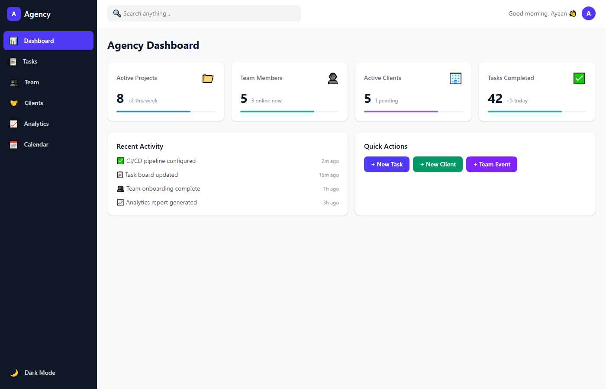

# Agency UI — Agency Management Dashboard

A modern, responsive agency management dashboard with 6 sections, built with **React 19 + TypeScript + Tailwind CSS v4 + Vite**.

> Built autonomously using [loop-energy](https://github.com/ayanshaikh2491-stack/loop-energy) — an autonomous agent loop framework with 3-layer maker-checker verification.

## ✨ Features

| Section | What's inside |
|---|---|
| **📊 Dashboard** | 4 stat cards with progress bars, recent activity feed, quick actions |
| **📋 Tasks** | Interactive Kanban board — Backlog → In Progress → Done, priority badges, move tasks with one click |
| **👥 Team** | Team member cards with avatars, online/away/offline status, task counts |
| **🤝 Clients** | Client table with sector, revenue, growth indicators, status badges |
| **📈 Analytics** | 4 stat cards + 12-month gradient bar chart |
| **📅 Calendar** | Current month grid with events, today highlighted, color legend |

Plus:
- 🌙 **Dark mode** — full dark theme via Tailwind v4 OKLCH colors
- 📱 **Responsive** — mobile to desktop (1/2/3/4 column grids)
- 🔍 **Search header** with user greeting
- ⚡ **Inter font**, soft shadows, smooth hover transitions

## 🖼️ Screenshots

Dashboard | Task Board
:---: | :---:
 | 

## 🚀 Quick Start

```bash
git clone https://github.com/ayanshaikh2491-stack/agency-ui.git
cd agency-ui
npm install
npm run dev
```

Open **http://localhost:5173** 🎉

## 🛠️ Build

```bash
npm run build    # tsc + vite build (passes clean)
npm run preview # preview the production build
```

## 🧱 Tech Stack

- **React 19** + TypeScript (strict)
- **Tailwind CSS v4** (`@import "tailwindcss"` + `@custom-variant dark`)
- **Vite 8** with `@tailwindcss/vite` plugin
- Zero UI libraries — pure Tailwind components

## 📁 Structure

```
src/
├── App.tsx                  # Layout: sidebar + header + section router
├── index.css                # Tailwind v4 import + dark variant
└── components/
    ├── TaskBoard.tsx        # Kanban board
    ├── TeamMembers.tsx      # Team grid
    ├── ClientList.tsx       # Client table
    ├── Analytics.tsx        # Stats + bar chart
    └── Calendar.tsx         # Month calendar
```

## 📜 License

MIT
